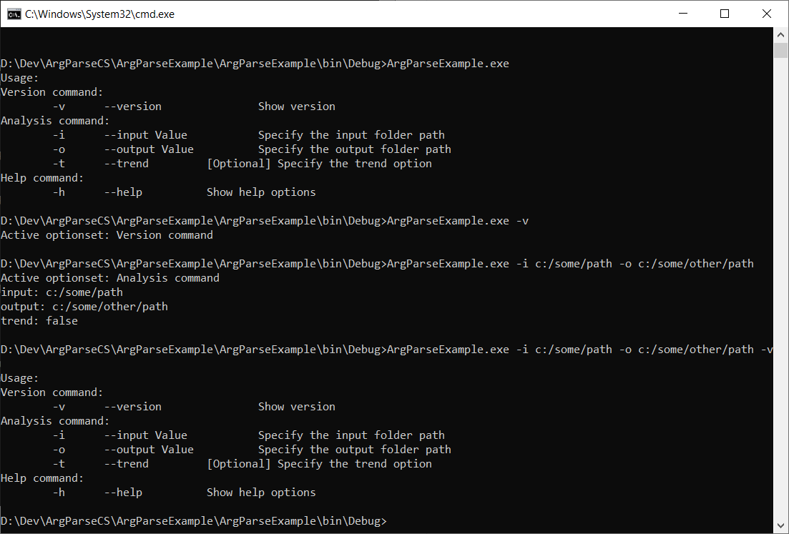

# Command line argument parser for C\#
If you have a complex set of arguments for a command line program in C\#, use this library to define your command options and conveniently access the specified parameters.

The library defines individual command in an ```OptionSet```. Each ```OptionSet``` may have a set of ```Options```. Each ```Option``` defines behavior of a specific option in a command.

Let us take an example where program name is ```myapp```. This application deals with three kinds of commands.
```
1. myapp -v
2. myapp -i <param1> -o <param2> -t
3. myapp --help
```
In this example, each of the three commands represent ```OptionSet``` and command options (such as ```-i```) refer to ```Option```. One ```OptionSet``` may have multiple ```Options```.

For OptionSet/command 2, options ```-i``` and ```-o``` are mandatory arguments with parameters. Option ```-t``` is optional and doesn't need any argument. It is desired that one set of command options are not used and mixed with other commands (for example, ```-i``` and ```-v``` should not be used together in a command).

We can specify the following to define the above described behavior.
```
ArgParse argParse = new ArgParse {
    new OptionSet("Version command") {
        new Option("-v", "--version", "Show version", true, false)
    },
    new OptionSet("Analysis command") {
        new Option("-i", "--input", "Specify the input folder path", true, true),
        new Option("-o", "--output", "Specify the output folder path", true, true),
        new Option("-t", "--trend", "Specify the trend option", false, false),
    },
    new OptionSet("Help command") {
        new Option("-h", "--help", "Show help options", true, false),
    }
};
```

Following screenshot captures the output of the above specification. The full example can be found in the ArgParseExample folder.

